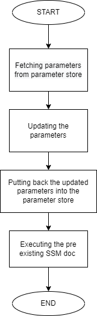

## Purpose
This document is intended to explain the design and implementation of the SSM doc sharing playbook.

## Description
When the playbook is executed, it executes the test.py python file which has boto3 commands to perform fetching,updating of parameter store and execution of existing SSM doc.

 - **AWS SSM Parameter Store** It helps in storing configuration variables.We can store passwords, database strings, Amazon Machine Image (AMI) IDs, and license codes as parameter values.
 
 -  **Boto3 commands** 
     - get_parameter - to get information from parameter store by giving few required inputs like Name of the parameter store.

     - put_parameter - to put parameters in the parameter store

     - start_automation_execution - to initiate the automation .

## Assumption

- SSM parameters
- SSM Doc should be existing in gp-ops account.

## Tasks

1. Getting the parameters from the parameter store.
2. Updating parameters with the account id's to the specific region.
3. Putting back the updated parameters back into parameter store
4. Executing the pre-existing SSM doc "share_existing_ssm_doc" 

## Design
 

## Variables

| Variable Name | Description | Required before independent execution?(Yes/No) |
| -- | -- | -- |
| aws_access_key_id | Unique name to identify the AWS account | Yes |
| aws_secret_access_key | It is a 12-digit number ,used to identify a AWS account | Yes |
| aws_session_token | AWS virtual network dedicated to the AWS account | Yes |.78] | Able to send mail on this server | Mail not sent
| region_name | AWS virtual network dedicated to the AWS account | Yes |.78] | Able to send mail on this server | Mail not sent

## Directory Structure
```
+---files
|       test.py
+---tasks
|       main.yml
+---vars
|       main.yml
```

## Directory Structure Explanation

*Parent directory:- account-provisioning/test-playbooks/roles/SSM_doc_sharing*
- **files/**
    | | |
    | -- | -- |
    | test.py | Contains boto3 commands to perform fetching,updating the values and executing docs of parameter store|


- **tasks/**
    | | |
    | -- | -- |
    | main.yml | Contains task to execute the test.py python file. |

- **vars/**
    | | |
    | -- | -- |
    | mail.yml | Contains aws access variables and account id's to be upadated in the parameter store. |

## Outputs

- The parameters were fetched from the parameter store.
- Parameters were updated with the AWS account Ids.
- Updated parameters were entered into the parameter store.
- SSM doc was been executed over all the updated account ids.

## Unit Testing

| S . No | Test case | Expected Output | Actual Output |
| -- | -- | -- | -- |
| 1 | Account Id of 12 digits(234568798543)   | Should append |  Appended (See fig.1)
| 2 | Account Id of more than 12 digits(234568798543465)   | Should not append | Not appended (See fig.2)
| 3 | Account Id of less than 12 digit(3496) | Should not append | Not appended (See fig.3)
| 4 | Account Id having alphabets(aws) | Should not append | Not appended (See fig.4)
| 5 | Account Id having alphanumeric value(aws2569876) | Should not append | Not appended (See fig.5)
| 6 | Account ids of different regions(eu-west-1)   | Should append after checking region |  Appended (See fig.6)
